# CI/CD Pipeline SysML Diagrams

This document contains SysML diagrams documenting the documentation deployment pipeline using Cloudflare R2, Workers, Jenkins, and Dagger CI/CD with native secret management.

## 1. Block Definition Diagram (BDD)

The BDD shows the hierarchical block structure of the documentation pipeline.

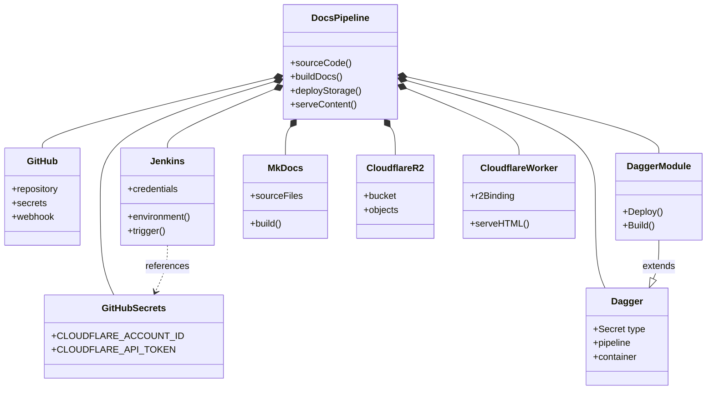

## 2. Internal Block Diagram (IBD)

The IBD shows the internal structure and data flow.

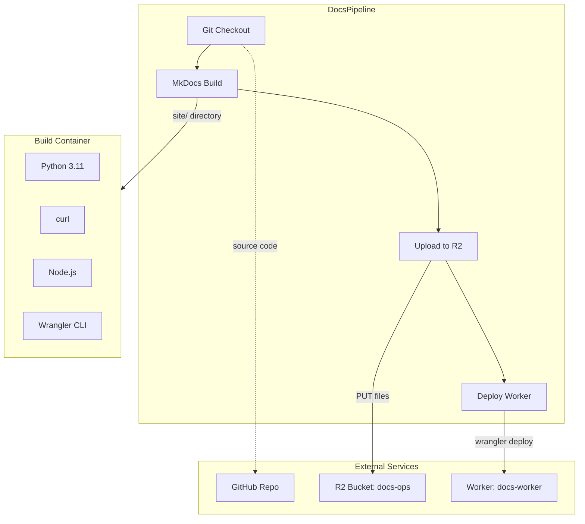

## 3. Sequence Diagram (SD)

The SD shows the deployment flow from commit to live site.

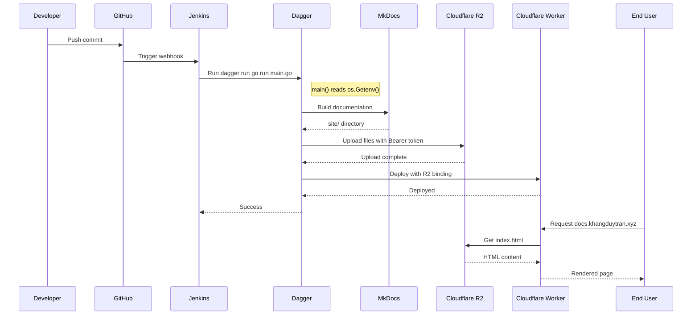

## 4. Block Definition Diagram - Dagger Module

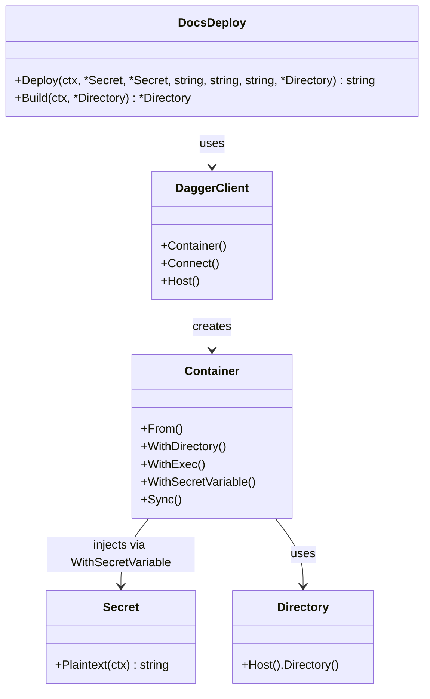

## 5. Internal Block Diagram - Secret Flow

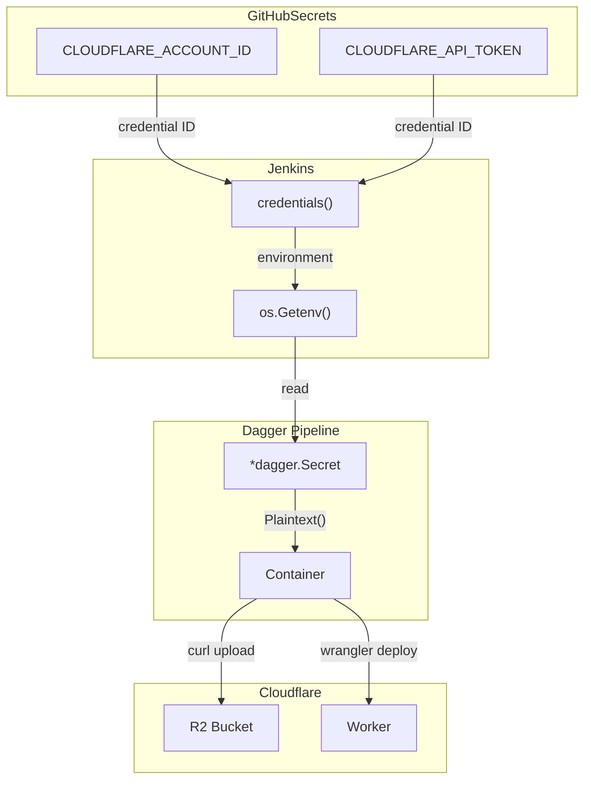

## 6. State Diagram

The state diagram shows the lifecycle of a documentation deployment.

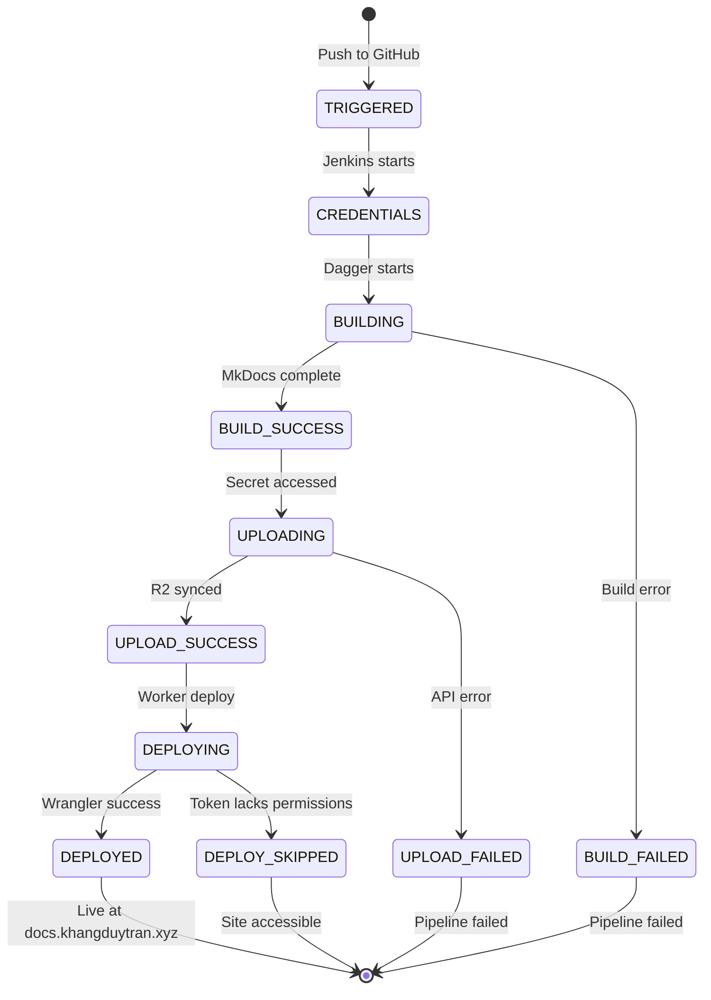

## 7. Sequence Diagram - Secret Flow

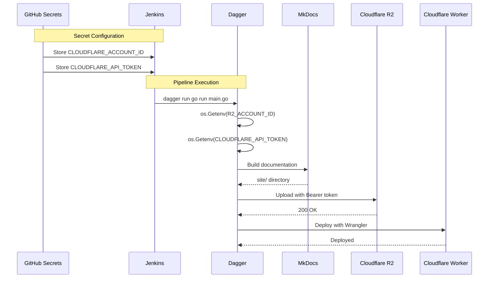

## 8. Requirement Diagram

System requirements for the documentation pipeline.

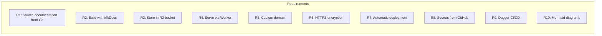

## 9. Parametric Diagram

Resource flow showing build and deploy volumes.

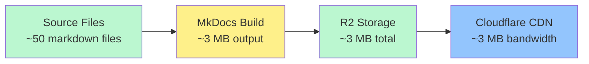

## 10. Allocation Diagram

Component deployment and configuration allocation.

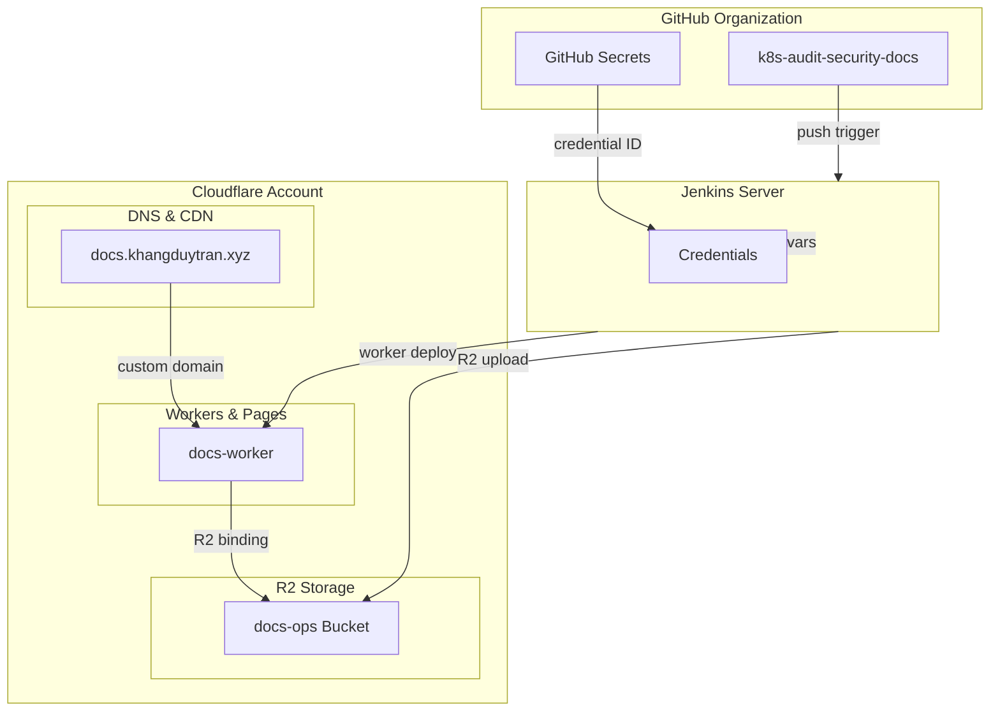

## 11. Activity Diagram

The AD shows the CI/CD build and deploy process.

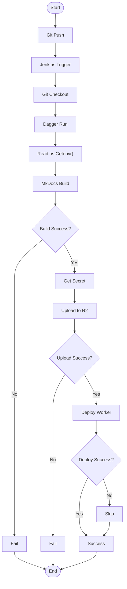

## 12. Communication Diagram - Dual Mode

Shows both Jenkins and CLI usage.

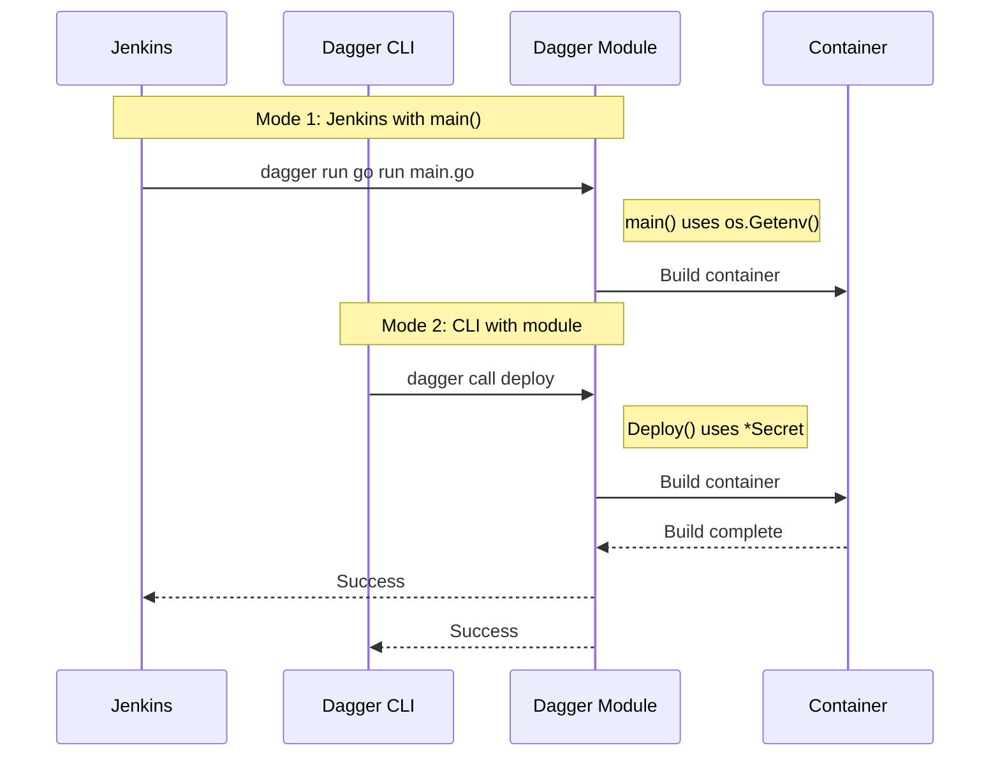

## 13. Block Definition Diagram - Components

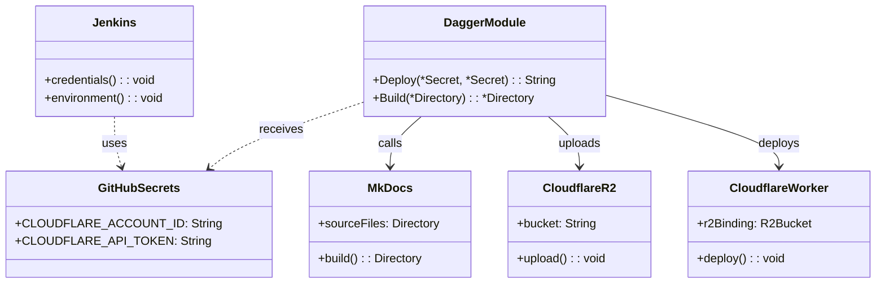
