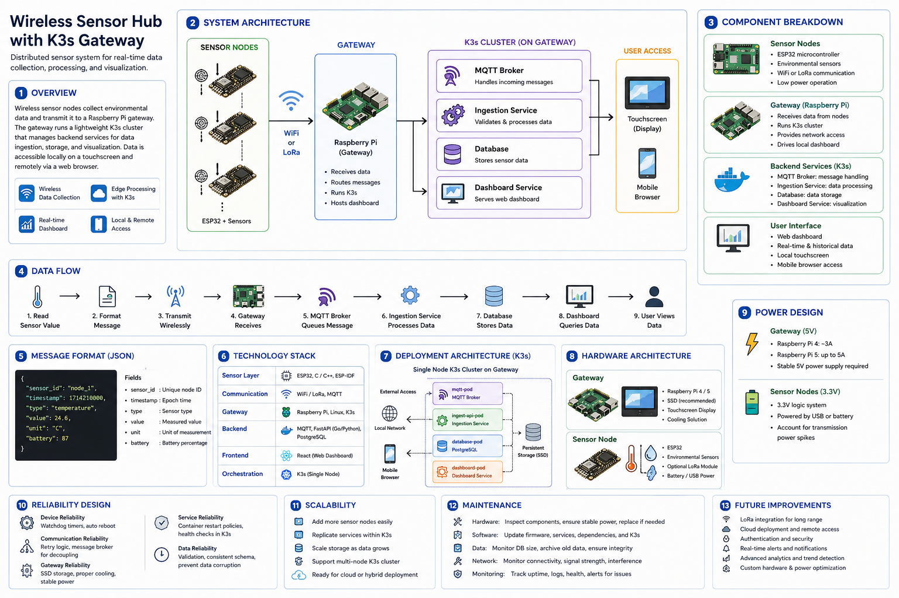

# Wireless Sensor Hub with K3s Gateway

A distributed sensor system designed to collect, process, and visualize environmental data using wireless sensor nodes and an edge computing gateway. The system provides real time data access through a web based dashboard, displayed locally on a touchscreen and remotely through mobile browsers.

---

## Explore Documentation

- **[Overview](overview/project-overview.md)** - Project overview, system architecture, components, and data flow  
- **[Design](design/message-format.md)** - Message format, technology stack, deployment, hardware, power, reliability, scalability, maintenance, and future improvements  
- **[Setup](setup/setup-and-installation.md)** - Installation guide, prerequisites, and configuration steps  
